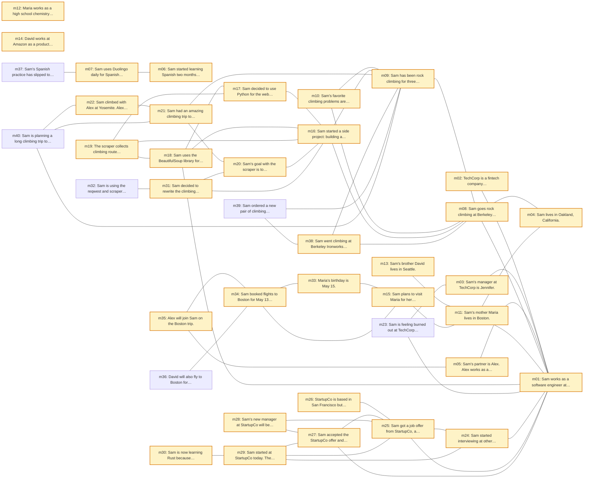

# A-Mem Memory Graph

Nodes are memories (in ingestion order). Edges are A-Mem links.
Highlighted nodes had at least one memory-evolution event.

```mermaid
graph LR
    m01["m01: Sam works as a software engineer at…"]
    m02["m02: TechCorp is a fintech company…"]
    m03["m03: Sam's manager at TechCorp is Jennifer."]
    m04["m04: Sam lives in Oakland, California."]
    m05["m05: Sam's partner is Alex. Alex works as a…"]
    m06["m06: Sam started learning Spanish two months…"]
    m07["m07: Sam uses Duolingo daily for Spanish…"]
    m08["m08: Sam goes rock climbing at Berkeley…"]
    m09["m09: Sam has been rock climbing for three…"]
    m10["m10: Sam's favorite climbing problems are…"]
    m11["m11: Sam's mother Maria lives in Boston."]
    m12["m12: Maria works as a high school chemistry…"]
    m13["m13: Sam's brother David lives in Seattle."]
    m14["m14: David works at Amazon as a product…"]
    m15["m15: Sam plans to visit Maria for her…"]
    m16["m16: Sam started a side project: building a…"]
    m17["m17: Sam decided to use Python for the web…"]
    m18["m18: Sam uses the BeautifulSoup library for…"]
    m19["m19: The scraper collects climbing route…"]
    m20["m20: Sam's goal with the scraper is to…"]
    m21["m21: Sam had an amazing climbing trip to…"]
    m22["m22: Sam climbed with Alex at Yosemite. Alex…"]
    m23["m23: Sam is feeling burned out at TechCorp…"]
    m24["m24: Sam started interviewing at other…"]
    m25["m25: Sam got a job offer from StartupCo, a…"]
    m26["m26: StartupCo is based in San Francisco but…"]
    m27["m27: Sam accepted the StartupCo offer and…"]
    m28["m28: Sam's new manager at StartupCo will be…"]
    m29["m29: Sam started at StartupCo today. The…"]
    m30["m30: Sam is now learning Rust because…"]
    m31["m31: Sam decided to rewrite the climbing…"]
    m32["m32: Sam is using the reqwest and scraper…"]
    m33["m33: Maria's birthday is May 15."]
    m34["m34: Sam booked flights to Boston for May 13…"]
    m35["m35: Alex will join Sam on the Boston trip."]
    m36["m36: David will also fly to Boston for…"]
    m37["m37: Sam's Spanish practice has slipped to…"]
    m38["m38: Sam went climbing at Berkeley Ironworks…"]
    m39["m39: Sam ordered a new pair of climbing…"]
    m40["m40: Sam is planning a long climbing trip to…"]
    m02 --- m01
    m03 --- m01
    m05 --- m01
    m07 --- m06
    m08 --- m04
    m08 --- m01
    m09 --- m08
    m10 --- m09
    m10 --- m08
    m11 --- m04
    m11 --- m01
    m13 --- m11
    m15 --- m11
    m16 --- m09
    m16 --- m08
    m17 --- m16
    m18 --- m17
    m18 --- m16
    m18 --- m01
    m19 --- m16
    m19 --- m17
    m19 --- m18
    m20 --- m16
    m21 --- m09
    m21 --- m20
    m22 --- m21
    m23 --- m01
    m23 --- m03
    m24 --- m01
    m25 --- m24
    m25 --- m01
    m26 --- m25
    m27 --- m25
    m27 --- m01
    m28 --- m27
    m28 --- m25
    m29 --- m25
    m29 --- m24
    m29 --- m27
    m30 --- m29
    m31 --- m20
    m31 --- m16
    m32 --- m31
    m33 --- m15
    m34 --- m15
    m34 --- m33
    m35 --- m05
    m35 --- m34
    m36 --- m34
    m37 --- m07
    m38 --- m08
    m38 --- m09
    m39 --- m09
    m39 --- m38
    m40 --- m21
    m40 --- m22
    m40 --- m09
    classDef evolved fill:#fef3c7,stroke:#d97706,stroke-width:2px
    class m01,m02,m03,m04,m05,m06,m07,m08,m09,m10,m11,m12,m13,m14,m15,m16,m17,m18,m19,m20,m21,m22,m24,m25,m26,m27,m28,m29,m30,m31,m33,m34,m35,m38 evolved
```
