# A-Mem Retrieval Traces

Solid arrows = direct vector-search hits.  
Dashed arrows = one-hop A-Mem link traversals.

## q01 — single_hop

**Q:** Where does Sam live?  
**Expected:** Oakland, California  
**Got:** Sam lives in Oakland, California.  
**Correct:** ✓

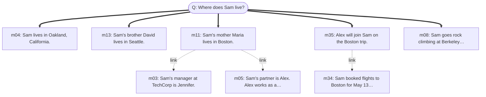

## q02 — single_hop

**Q:** What is Maria's profession?  
**Expected:** high school chemistry teacher  
**Got:** Maria works as a high school chemistry teacher.  
**Correct:** ✓

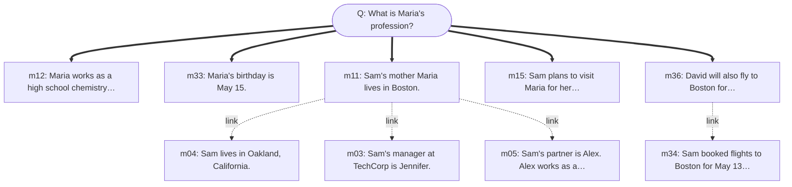

## q03 — single_hop

**Q:** When is Maria's birthday?  
**Expected:** May 15  
**Got:** Maria's birthday is May 15.  
**Correct:** ✓

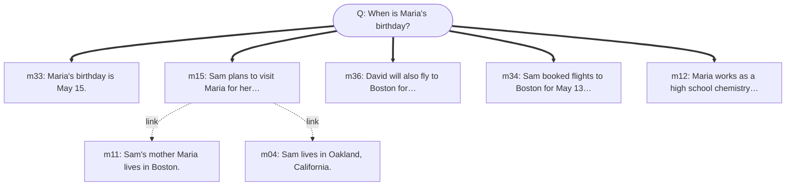

## q04 — single_hop

**Q:** What climbing shoes did Sam order?  
**Expected:** La Sportiva Solution  
**Got:** Sam ordered the La Sportiva Solution climbing shoes.  
**Correct:** ✓

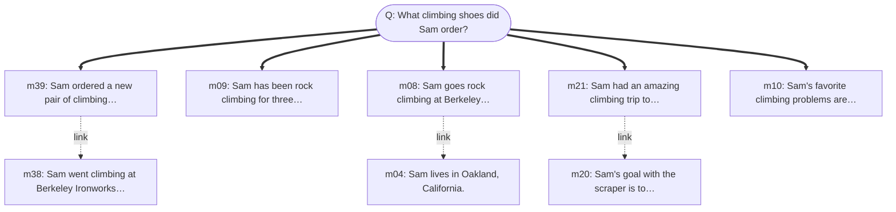

## q05 — two_hop

**Q:** In which city is the company that David works for headquartered?  
**Expected:** Seattle  
**Got:** The company that David works for, Amazon, is headquartered in Seattle.  
**Correct:** ✓

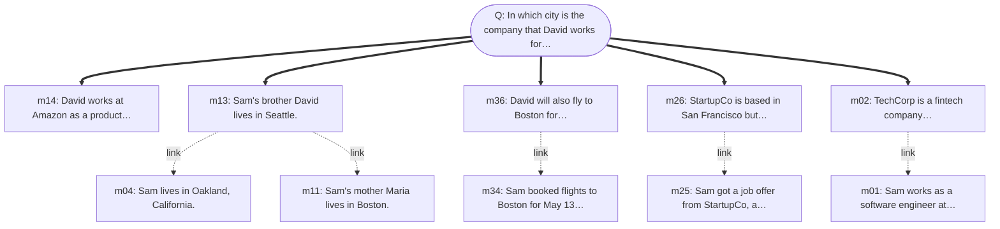

## q06 — two_hop

**Q:** What programming language does Sam's web scraper use?  
**Expected:** Python (initially), then rewritten in Rust  
**Got:** Sam's web scraper uses Rust.  
**Correct:** ✗

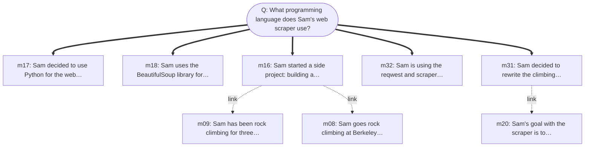

## q07 — two_hop

**Q:** What does Sam's mother do for a living, and where does she live?  
**Expected:** high school chemistry teacher in Boston  
**Got:** unknown / not mentioned  
**Correct:** ✗

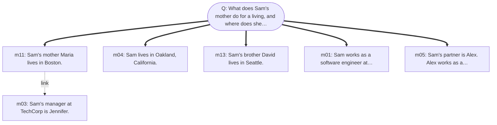

## q08 — deep_multi_hop

**Q:** Who is the manager of the person whose brother works at Amazon?  
**Expected:** Marcus  
**Got:** Jennifer is the manager of the person whose brother works at Amazon.  
**Correct:** ✗

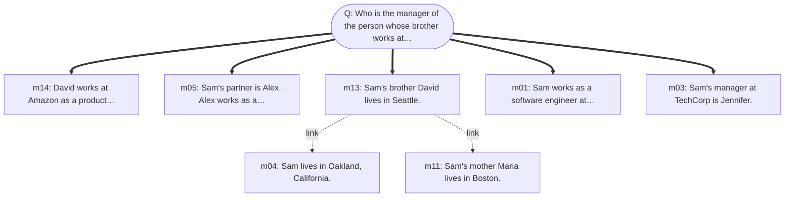

## q09 — deep_multi_hop

**Q:** What is the profession of the partner of the engineer who has a brother in Seattle?  
**Expected:** graphic designer  
**Got:** The partner of the engineer is a graphic designer.  
**Correct:** ✓

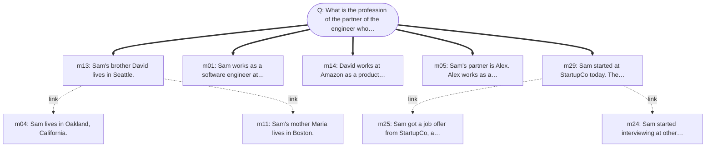

## q10 — deep_multi_hop

**Q:** In which city was the person born who is married to the graphic designer's partner's brother?  
**Expected:** unknown / cannot determine (Maria's birth location is not in the facts)  
**Got:** unknown / not mentioned  
**Correct:** ✗

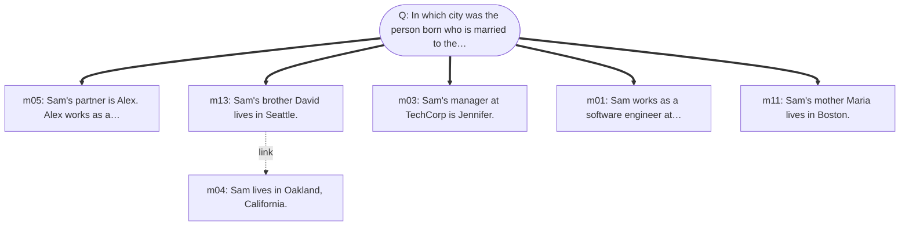

## q11 — implicit_conceptual

**Q:** What outdoor activities does Sam enjoy?  
**Expected:** rock climbing (Yosemite, Joshua Tree, Berkeley Ironworks — though gym is indoor)  
**Got:** Sam enjoys rock climbing.  
**Correct:** ✗

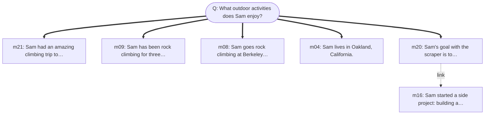

## q12 — implicit_conceptual

**Q:** What Python libraries has Sam used?  
**Expected:** BeautifulSoup  
**Got:** unknown / not mentioned  
**Correct:** ✗

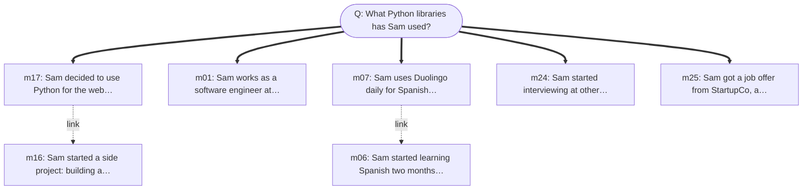

## q13 — implicit_conceptual

**Q:** What hobbies has Sam been less active in lately?  
**Expected:** Spanish learning (slipped to once a week) and climbing (first session in two weeks before m38)  
**Got:** unknown / not mentioned  
**Correct:** ✗

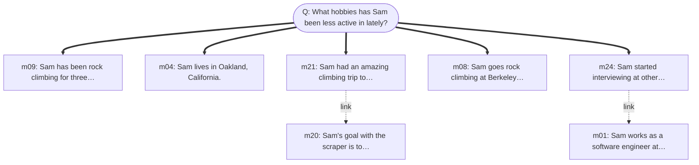

## q14 — information_update

**Q:** Where does Sam currently work?  
**Expected:** StartupCo  
**Got:** Sam currently works at StartupCo.  
**Correct:** ✓

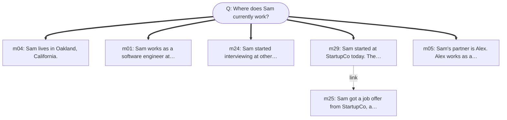

## q15 — information_update

**Q:** Who is Sam's current manager?  
**Expected:** Marcus  
**Got:** Sam's current manager is Marcus.  
**Correct:** ✓

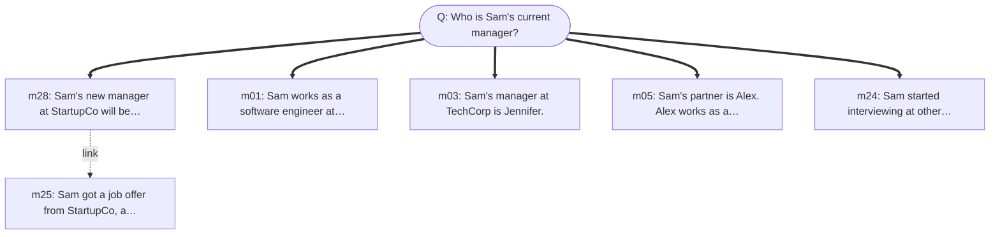

## q16 — information_update

**Q:** What language is Sam's climbing scraper currently written in?  
**Expected:** Rust  
**Got:** Sam's climbing scraper is currently written in Rust.  
**Correct:** ✓

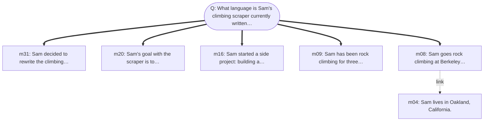

## q17 — compositional_aggregation

**Q:** Who are all the people Sam has mentioned in conversations?  
**Expected:** Alex (partner), Jennifer (old manager), Maria (mother), David (brother), Marcus (new manager)  
**Got:** Sam has mentioned Alex, Maria, Jennifer, and Marcus in conversations.  
**Correct:** ✗

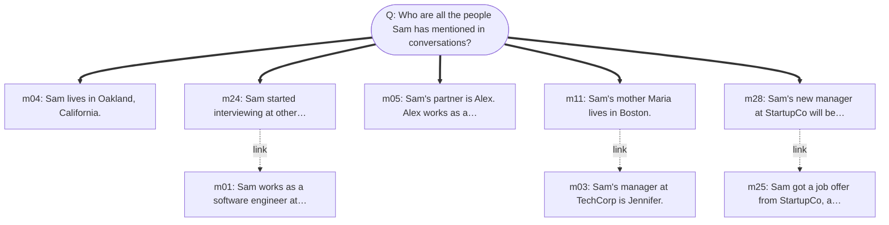

## q18 — compositional_aggregation

**Q:** What different programming languages and libraries has Sam used or learned?  
**Expected:** Python, BeautifulSoup, Rust, reqwest, scraper  
**Got:** Sam has used or learned Python, Rust, and possibly others for work, but the specific libraries are unknown / not mentioned.  
**Correct:** ✗

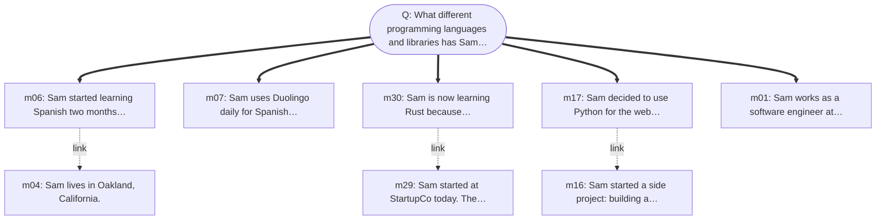

## q19 — compositional_aggregation

**Q:** What places does Sam have travel or residence connections to?  
**Expected:** Oakland (lives), San Francisco (work), Boston (mother + planned trip), Seattle (brother), Yosemite (climbed), Joshua Tree (planned trip), Mexico (Spanish learning motivation)  
**Got:** Sam has connections to Oakland, Boston, and Seattle.  
**Correct:** ✗

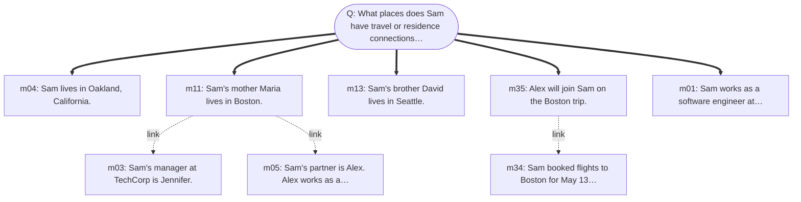

## q20 — absence_abstention

**Q:** What is Sam's favorite food?  
**Expected:** unknown / not mentioned  
**Got:** unknown / not mentioned  
**Correct:** ✓

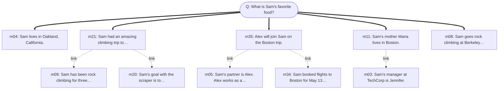

## q21 — absence_abstention

**Q:** Does Sam have any pets?  
**Expected:** unknown / not mentioned  
**Got:** unknown / not mentioned  
**Correct:** ✓

```mermaid
graph TD
    Q(["Q: Does Sam have any pets?"])
    m04["m04: Sam lives in Oakland, California."]
    Q ==> m04
    m35["m35: Alex will join Sam on the Boston trip."]
    Q ==> m35
    m13["m13: Sam's brother David lives in Seattle."]
    Q ==> m13
    m11["m11: Sam's mother Maria lives in Boston."]
    Q ==> m11
    m05["m05: Sam's partner is Alex. Alex works as a…"]
    Q ==> m05
    m34["m34: Sam booked flights to Boston for May 13…"]
    m35 -.->|link| m34
    m03["m03: Sam's manager at TechCorp is Jennifer."]
    m11 -.->|link| m03
    m01["m01: Sam works as a software engineer at…"]
    m05 -.->|link| m01
```

## q22 — absence_abstention

**Q:** What is Sam's salary at StartupCo?  
**Expected:** unknown / not mentioned  
**Got:** unknown / not mentioned  
**Correct:** ✓

```mermaid
graph TD
    Q(["Q: What is Sam's salary at StartupCo?"])
    m29["m29: Sam started at StartupCo today. The…"]
    Q ==> m29
    m25["m25: Sam got a job offer from StartupCo, a…"]
    Q ==> m25
    m27["m27: Sam accepted the StartupCo offer and…"]
    Q ==> m27
    m28["m28: Sam's new manager at StartupCo will be…"]
    Q ==> m28
    m01["m01: Sam works as a software engineer at…"]
    Q ==> m01
    m24["m24: Sam started interviewing at other…"]
    m29 -.->|link| m24
```
