# A-Mem Retrieval Traces

Solid arrows = direct vector-search hits.  
Dashed arrows = one-hop A-Mem link traversals.

## Q00001 — single_hop

**Q:** Where does Sam live?  
**Expected:** Oakland, California  
**Got:** Sam lives in Oakland, California.  
**Correct:** ✓

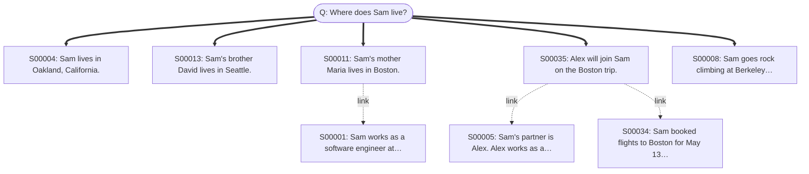

## Q00002 — single_hop

**Q:** What is Maria's profession?  
**Expected:** high school chemistry teacher  
**Got:** Maria works as a high school chemistry teacher.  
**Correct:** ✓

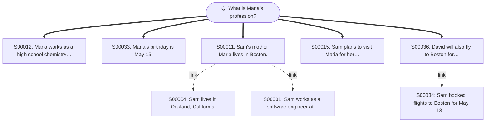

## Q00003 — single_hop

**Q:** When is Maria's birthday?  
**Expected:** May 15  
**Got:** Maria's birthday is May 15.  
**Correct:** ✓

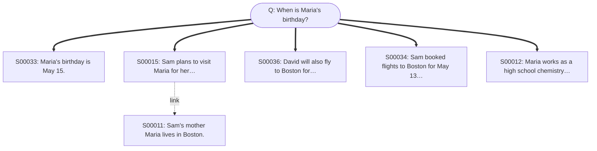

## Q00004 — single_hop

**Q:** What climbing shoes did Sam order?  
**Expected:** La Sportiva Solution  
**Got:** Sam ordered the La Sportiva Solution climbing shoes.  
**Correct:** ✓

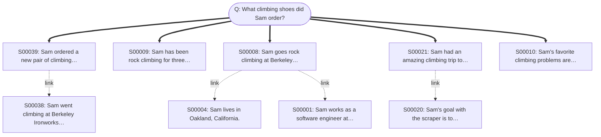

## Q00005 — two_hop

**Q:** In which city is the company that David works for headquartered?  
**Expected:** Seattle  
**Got:** The company that David works for, Amazon, is headquartered in Seattle.  
**Correct:** ✓

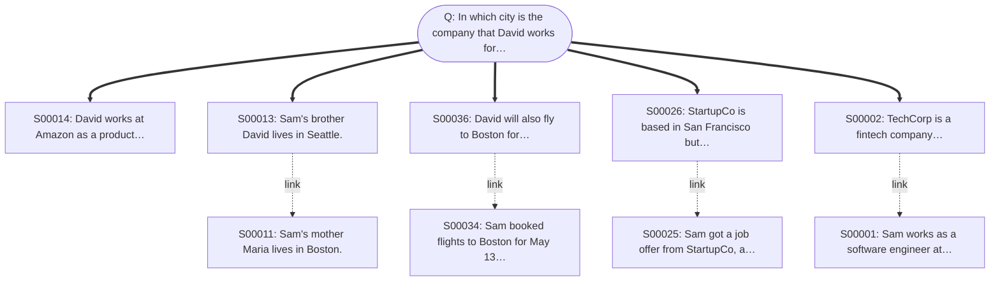

## Q00006 — two_hop

**Q:** What programming language does Sam's web scraper use?  
**Expected:** Python (initially), then rewritten in Rust  
**Got:** Sam's web scraper uses Rust.  
**Correct:** ✗

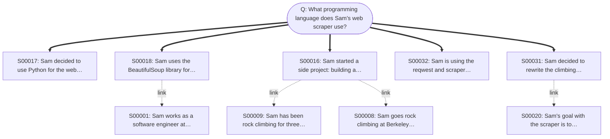

## Q00007 — two_hop

**Q:** What does Sam's mother do for a living, and where does she live?  
**Expected:** high school chemistry teacher in Boston  
**Got:** unknown / not mentioned  
**Correct:** ✗

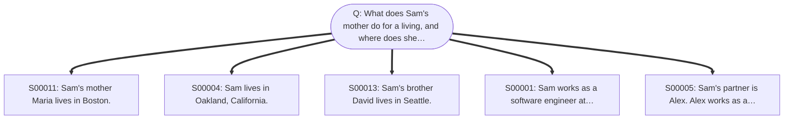

## Q00008 — deep_multi_hop

**Q:** Who is the manager of the person whose brother works at Amazon?  
**Expected:** Marcus  
**Got:** Jennifer is the manager of the person whose brother works at Amazon.  
**Correct:** ✗

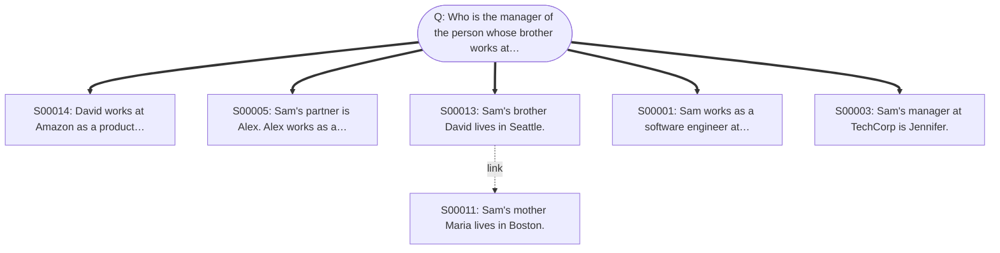

## Q00009 — deep_multi_hop

**Q:** What is the profession of the partner of the engineer who has a brother in Seattle?  
**Expected:** graphic designer  
**Got:** The partner of the engineer is a graphic designer.  
**Correct:** ✓

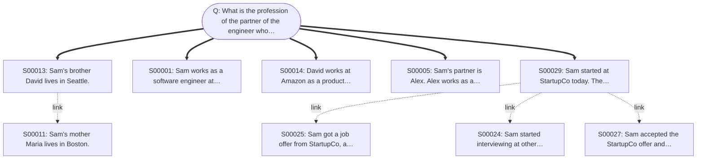

## Q00010 — deep_multi_hop

**Q:** In which city was the person born who is married to the graphic designer's partner's brother?  
**Expected:** unknown / cannot determine (Maria's birth location is not in the facts)  
**Got:** unknown / not mentioned  
**Correct:** ✗

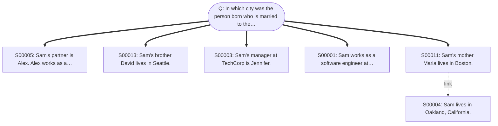

## Q00011 — implicit_conceptual

**Q:** What outdoor activities does Sam enjoy?  
**Expected:** rock climbing (Yosemite, Joshua Tree, Berkeley Ironworks — though gym is indoor)  
**Got:** Sam enjoys rock climbing.  
**Correct:** ✗

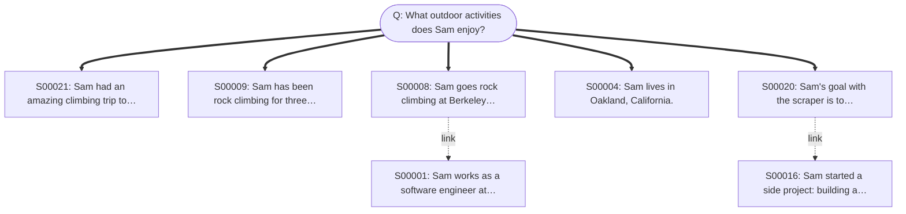

## Q00012 — implicit_conceptual

**Q:** What Python libraries has Sam used?  
**Expected:** BeautifulSoup  
**Got:** unknown / not mentioned  
**Correct:** ✗

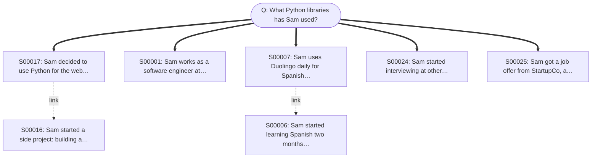

## Q00013 — implicit_conceptual

**Q:** What hobbies has Sam been less active in lately?  
**Expected:** Spanish learning (slipped to once a week) and climbing (first session in two weeks before m38)  
**Got:** unknown / not mentioned  
**Correct:** ✗

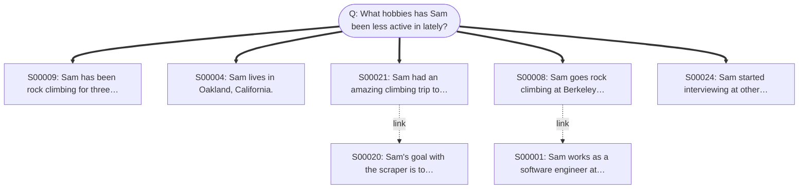

## Q00014 — information_update

**Q:** Where does Sam currently work?  
**Expected:** StartupCo  
**Got:** Sam currently works at StartupCo.  
**Correct:** ✓

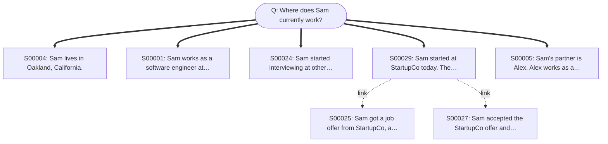

## Q00015 — information_update

**Q:** Who is Sam's current manager?  
**Expected:** Marcus  
**Got:** Sam's current manager is Marcus.  
**Correct:** ✓

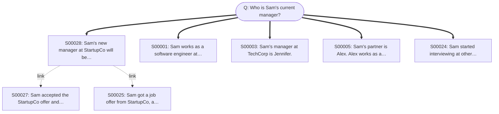

## Q00016 — information_update

**Q:** What language is Sam's climbing scraper currently written in?  
**Expected:** Rust  
**Got:** Sam's climbing scraper is currently written in Rust.  
**Correct:** ✓

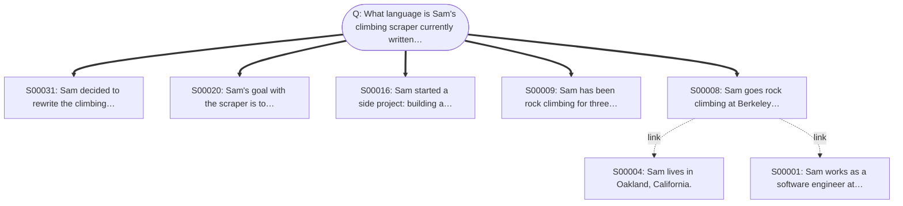

## Q00017 — compositional_aggregation

**Q:** Who are all the people Sam has mentioned in conversations?  
**Expected:** Alex (partner), Jennifer (old manager), Maria (mother), David (brother), Marcus (new manager)  
**Got:** Sam has mentioned Alex, Maria, and Marcus in conversations.  
**Correct:** ✗

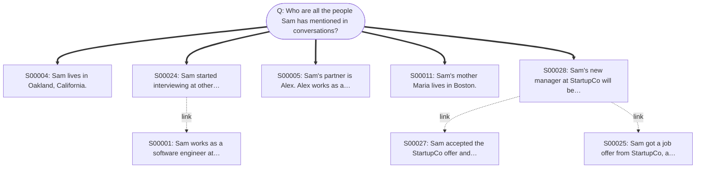

## Q00018 — compositional_aggregation

**Q:** What different programming languages and libraries has Sam used or learned?  
**Expected:** Python, BeautifulSoup, Rust, reqwest, scraper  
**Got:** Sam has used or learned Python, Rust, and possibly others for work, but no other specific languages or libraries are mentioned besides these two.  
**Correct:** ✗

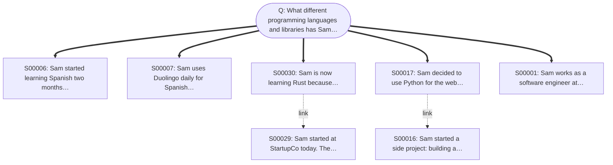

## Q00019 — compositional_aggregation

**Q:** What places does Sam have travel or residence connections to?  
**Expected:** Oakland (lives), San Francisco (work), Boston (mother + planned trip), Seattle (brother), Yosemite (climbed), Joshua Tree (planned trip), Mexico (Spanish learning motivation)  
**Got:** Sam has connections to Oakland, Boston, and Seattle.  
**Correct:** ✗

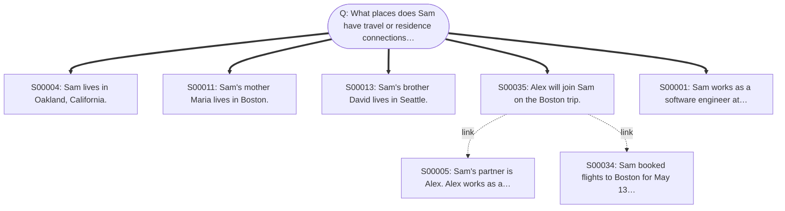

## Q00020 — absence_abstention

**Q:** What is Sam's favorite food?  
**Expected:** unknown / not mentioned  
**Got:** unknown / not mentioned  
**Correct:** ✓

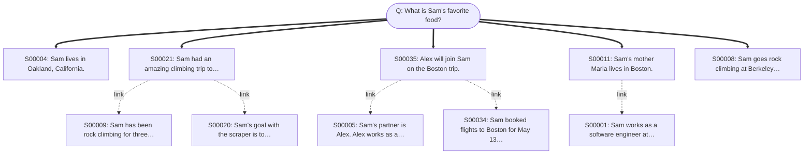

## Q00021 — absence_abstention

**Q:** Does Sam have any pets?  
**Expected:** unknown / not mentioned  
**Got:** unknown / not mentioned  
**Correct:** ✓

```mermaid
graph TD
    Q(["Q: Does Sam have any pets?"])
    S00004["S00004: Sam lives in Oakland, California."]
    Q ==> S00004
    S00035["S00035: Alex will join Sam on the Boston trip."]
    Q ==> S00035
    S00013["S00013: Sam's brother David lives in Seattle."]
    Q ==> S00013
    S00011["S00011: Sam's mother Maria lives in Boston."]
    Q ==> S00011
    S00005["S00005: Sam's partner is Alex. Alex works as a…"]
    Q ==> S00005
    S00034["S00034: Sam booked flights to Boston for May 13…"]
    S00035 -.->|link| S00034
    S00001["S00001: Sam works as a software engineer at…"]
    S00011 -.->|link| S00001
```

## Q00022 — absence_abstention

**Q:** What is Sam's salary at StartupCo?  
**Expected:** unknown / not mentioned  
**Got:** unknown / not mentioned  
**Correct:** ✓

```mermaid
graph TD
    Q(["Q: What is Sam's salary at StartupCo?"])
    S00029["S00029: Sam started at StartupCo today. The…"]
    Q ==> S00029
    S00025["S00025: Sam got a job offer from StartupCo, a…"]
    Q ==> S00025
    S00027["S00027: Sam accepted the StartupCo offer and…"]
    Q ==> S00027
    S00028["S00028: Sam's new manager at StartupCo will be…"]
    Q ==> S00028
    S00001["S00001: Sam works as a software engineer at…"]
    Q ==> S00001
    S00024["S00024: Sam started interviewing at other…"]
    S00029 -.->|link| S00024
```
